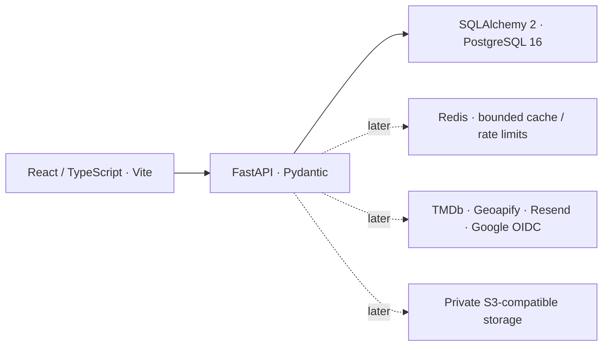

# Tandem target architecture

Tandem is a private shared-memory and nostalgia web application for desktop use. Keep the existing React application and introduce one Python backend and one relational database.

## Foundation choices

- One deployable FastAPI application. `api/` owns HTTP concerns, `schemas/` API validation, `services/` use cases and transaction boundaries, `models/` SQL mapping, `db/` connection/session ownership, `core/` configuration/logging, and `integrations/` future outbound clients. Empty modules are intentional; no speculative service layer or product models.
- SQLAlchemy 2 synchronous sessions with psycopg 3. Synchronous routes run database calls in FastAPI's worker threads. Engine lifecycle is managed through FastAPI lifespan; bounded connection pool, pre-ping, connection/pool/statement timeouts, explicit commits and session rollback/close protect resources.
- Pydantic Settings requires a credential-bearing `postgresql+psycopg` URL, validates environment and local origins, masks configuration values and produces a generic startup failure. Local Python commands read repository `.env.local`; container environment overrides it. Backend images do not copy local env files.
- `GET /api/health` runs `SELECT 1`: 200 with `{"status":"ok","application":"ok","database":"ok"}`, or 503 with `{"status":"degraded","application":"ok","database":"unavailable"}`. No URL, exception, credentials or provider details. This is application/database readiness, not migration-state or Redis readiness.
- Structured JSON logs contain time, severity, event name, correlation ID and request duration/status. Incoming request IDs must be UUIDs; otherwise generate one and return it in `X-Request-ID`. Request bodies, headers, query strings, SQL parameters and exception text are excluded from our request/database error logs.
- Development CORS allows explicit local HTTP origins only, without credentialed requests. It is disabled in test/production. This is not the future auth configuration. Vite proxies `/api` to the backend; backend endpoints do not require frontend secrets.
- Alembic owns schema evolution. `0001_foundation` is intentionally empty: only `alembic_version` exists after upgrade. No `create_all`, automatic startup migrations or data migration. Run migrations explicitly as a deployment/development step.
- Docker Compose runs frontend, backend, PostgreSQL 16 and Redis 7, with loopback-only published ports and named PostgreSQL/Redis volumes. Redis uses AOF and is independently health-checked. Backend readiness and product behavior do not depend on Redis. No MinIO/object storage container.
- npm remains the frontend manager; Vite remains the build tool. New meaningful boundaries use TypeScript with strict checking; old JSX remains to avoid churn. DOMPurify is shared by every legacy rich-HTML sink and editor insertion. Sanitization is mandatory even for old database content.

## Later authorization and data ownership

Google OAuth/OIDC will establish identity at the backend. Memberships will define access to each tandem; every read/write will check that access. User-supplied IDs, a selected UI tab and hardcoded groups are not authorization. Before introducing product API endpoints, settle session/cookie/CSRF policy and add negative tests for unauthorized and cross-tandem access.

PostgreSQL will own user, tandem, membership, event and movie/watchlist records. Use ordinary relational constraints and short transactions; retain legacy import mappings. Do not derive ownership from participant names or silently map global movie collections into a user account. Keep Firestore until each replacement has verified parity; do not create new Firebase collections or dual-write systems.

## Later external integrations

Provider credentials belong only in backend runtime secrets. TMDb/Geoapify/Resend clients belong in `integrations/`, with request timeouts, normalized schemas, bounded results, controlled errors and tests. Frontend requests go through purpose-specific backend endpoints; no arbitrary URL proxy. Existing movie title/person/credits behavior is preserved for reconnection. Existing Foursquare place snapshots retain their original source during the later Geoapify change.

Private media will use S3-compatible storage later. The backend will authorize uploads/downloads, enforce object ownership and size/type policy, store metadata in PostgreSQL and issue short-lived signed URLs. No public bucket or permanent public object URLs. No media implementation now.

Redis may later support expiring provider-response caches and bounded rate limits when justified. Define TTLs, size limits, failure behavior and privacy rules for every use. It will not be the source of truth, an event bus, a speculative job platform or a dependency for this milestone's product behavior.

## Deliberate exclusions

No authentication implementation, feature endpoints, application tables, data migration, UI redesign, PWA or mobile-app work in this milestone. No new Firebase infrastructure, Kafka, Kubernetes, Celery, microservices, event sourcing, CQRS, Elasticsearch or GraphQL. Desktop-first does not require removing existing responsive CSS.

Follow the ordered migration tasks in [REPOSITORY_AUDIT.md](REPOSITORY_AUDIT.md#7-proposed-migration-map-and-exact-next-tasks). The old root planning documents are historical and do not override this architecture.

## Implementation references

The lifecycle/session choices follow [FastAPI lifespan](https://fastapi.tiangolo.com/advanced/events/) and [SQLAlchemy session ownership](https://docs.sqlalchemy.org/en/20/orm/session_basics.html). The sanitizer uses [DOMPurify's explicit tag and attribute controls](https://github.com/cure53/DOMPurify). Secret tooling uses [Gitleaks](https://github.com/gitleaks/gitleaks), with current-source scans separated from historical incident cleanup.
