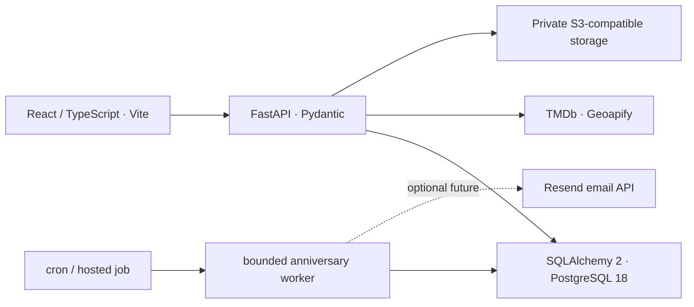

# Tandem target architecture

Tandem is a private shared-memory and nostalgia web application for desktop use. Keep the existing React application and introduce one Python backend and one relational database.

## Foundation choices

- One deployable FastAPI application. `api/` owns HTTP concerns, `schemas/` API validation, `services/` use cases and transaction boundaries, `models/` SQL mapping, `db/` connection/session ownership, `core/` configuration/logging, and `integrations/` future outbound clients. Empty modules are intentional; no speculative service layer or product models.
- SQLAlchemy 2 synchronous sessions with psycopg 3. Synchronous routes run database calls in FastAPI's worker threads. Engine lifecycle is managed through FastAPI lifespan; bounded connection pool, pre-ping, connection/pool/statement timeouts, explicit commits and session rollback/close protect resources.
- Pydantic Settings requires a credential-bearing `postgresql+psycopg` URL, validates environment and local origins, masks configuration values and produces a generic startup failure. Local Python commands read repository `.env.local`; container environment overrides it. Backend images do not copy local env files.
- `GET /healthz` is a cheap liveness check. `GET /api/health` and `/api/readyz` run `SELECT 1`: 200 with `{"status":"ok","application":"ok","database":"ok"}`, or 503 with a generic degraded response. No URL, exception, credentials or provider details.
- Structured JSON logs contain time, severity, event name, correlation ID and request duration/status. Incoming request IDs must be UUIDs; otherwise generate one and return it in `X-Request-ID`. Request bodies, headers, query strings, SQL parameters and exception text are excluded from our request/database error logs.
- Development CORS allows explicit local HTTP origins only and is disabled in test/production. Production state-changing requests require the exact same-origin Origin/Referer. Vite proxies `/api` locally; backend endpoints do not require frontend secrets.
- Alembic owns schema evolution. `0001_foundation` is intentionally empty: only `alembic_version` exists after upgrade. No `create_all`, automatic startup migrations or data migration. Run migrations explicitly as a deployment/development step.
- The first product slice uses one Tandem-scoped `memories` entity with strict category metadata, participant/tag joins, PostgreSQL full-text search, optimistic versions, append-only activity records, provider snapshots, and private processed media. PostgreSQL is authoritative; the anniversary outbox/worker is included, while Redis, notifications beyond that worker, and realtime updates remain out of scope.
- On This Day is a backend service over the represented `local_date`. It converts an injected/current instant into each requesting user's IANA timezone, matches earlier memories by local month/day, and applies the explicit Feb 29 rule: Feb 29 memories surface on Feb 29 in leap years and Feb 28 otherwise. The frontend never calculates eligibility.
- Anniversary email intents use a PostgreSQL transactional outbox retained for a future release. At v1 launch, `EMAIL_DELIVERY_ENABLED=false`: the bounded `python -m app.workers.anniversary` process always generates deduplicated in-app notifications, but creates no new email outbox rows and does not load Resend. When later enabled, it revalidates privacy before sending through Resend and applies three-attempt exponential backoff. A crash after provider acceptance and before the database update can still result in an occasional duplicate; the database idempotency key prevents duplicate queued intents, not provider-side exactly-once delivery.
- Docker Compose runs a development frontend, backend, PostgreSQL 18 and Redis with loopback-only published ports and named persistent volumes. Production uses the root multi-stage Dockerfile and no Compose/Redis dependency. Hosted S3-compatible storage is configured externally.
- npm remains the frontend manager; Vite remains the build tool. New meaningful boundaries use TypeScript with strict checking; old JSX remains to avoid churn. DOMPurify is shared by every legacy rich-HTML sink and editor insertion. Sanitization is mandatory even for old database content.

## Later authorization and data ownership

Google OAuth/OIDC will establish identity at the backend. Memberships will define access to each tandem; every read/write will check that access. User-supplied IDs, a selected UI tab and hardcoded groups are not authorization. Before introducing product API endpoints, settle session/cookie/CSRF policy and add negative tests for unauthorized and cross-tandem access.

PostgreSQL owns user, tandem, membership, invitation, memory, and movie snapshot records. Use
ordinary relational constraints and short transactions. Watchlist is a documented P1 follow-up;
when implemented it must also be Tandem-scoped and PostgreSQL-backed. Do not derive ownership
from participant names or silently map global legacy collections into a user account. Firebase is
retired and no new Firebase collections or dual-write systems are allowed.

## Later external integrations

Provider credentials belong only in backend runtime secrets. TMDb/Geoapify/Resend clients belong in
`integrations/`, with request timeouts, normalized schemas, bounded results, controlled errors and
tests. Frontend requests go through purpose-specific backend endpoints; no arbitrary URL proxy.
Saved provider snapshots remain usable when a provider is unavailable.

Private media uses S3-compatible storage. The backend authorizes uploads/downloads, enforces object ownership and size/type policy, stores metadata in PostgreSQL and issues short-lived signed URLs. No public bucket or permanent public object URLs.

Small in-process rate limits protect OAuth entry, invitations, provider searches, and media uploads
on the single Render instance. They are deliberately not a distributed security boundary; a
multi-instance deployment must move them to a shared or edge limiter.

## Notification operations

Outbound email is intentionally deferred for v1. Keep the email preference, outbox, and Resend
adapter for later. To re-enable it, set `EMAIL_DELIVERY_ENABLED=true`, provide `RESEND_API_KEY`
and `RESEND_FROM_EMAIL`/`RESEND_FROM_ADDRESS`, and use a verified sending domain. The email
contains no memory title, note, or photo; it says that a memory is waiting and links to Tandem.
Run `cd backend; python -m app.workers.anniversary` from a scheduler at least hourly. Set
`MIGRATION_DATABASE_URL` to the separately controlled worker/service connection (the process
falls back to `DATABASE_URL` for a deliberately simple deployment). The worker is intentionally
bounded, so cron, GitHub Actions, or a hosted scheduled job can own scheduling without adding a
queue service. Delivery is privacy-first and at-least-once at the provider boundary.

## Deliberate exclusions

No data migration, UI redesign, PWA or mobile-app work in this milestone. No Firebase
infrastructure, Kafka, Kubernetes, Celery, microservices, event sourcing, CQRS, Elasticsearch,
GraphQL, Redis caching, or WebSockets. Desktop-first does not require removing existing responsive
CSS.

Follow the ordered migration tasks in [REPOSITORY_AUDIT.md](REPOSITORY_AUDIT.md#7-proposed-migration-map-and-exact-next-tasks). The old root planning documents are historical and do not override this architecture.

## Implementation references

The lifecycle/session choices follow [FastAPI lifespan](https://fastapi.tiangolo.com/advanced/events/) and [SQLAlchemy session ownership](https://docs.sqlalchemy.org/en/20/orm/session_basics.html). The sanitizer uses [DOMPurify's explicit tag and attribute controls](https://github.com/cure53/DOMPurify). Secret tooling uses [Gitleaks](https://github.com/gitleaks/gitleaks), with current-source scans separated from historical incident cleanup.
